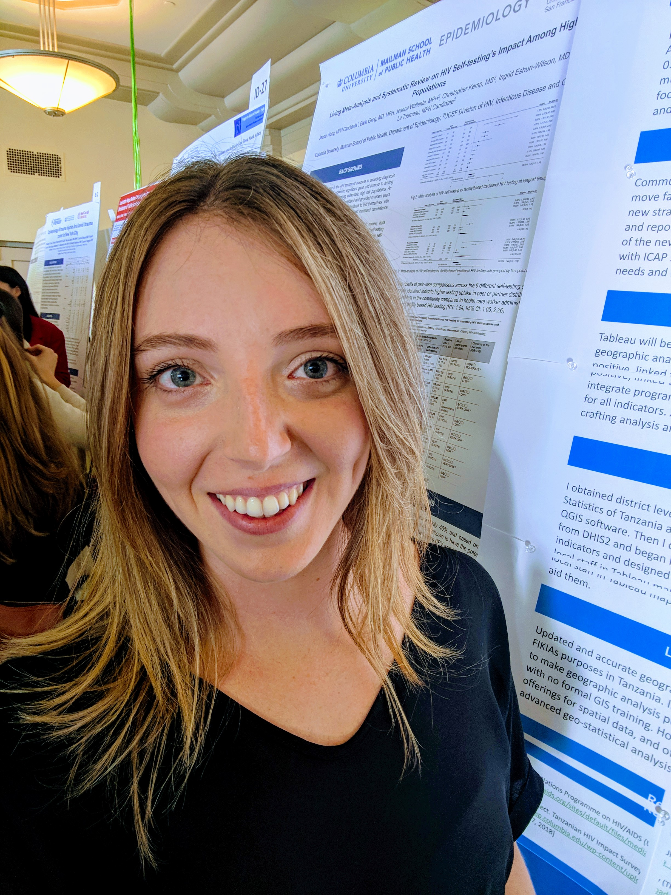

I am a map nerd. In my spare time I digitize remote villages and refugee camps around the world as a member of the Humanitarian OpenStreetMap Team. I do this because I want to live a value-based-life rooted in courage, curiosity, and compassion. Volunteering my time and skills in geographic information systems (GIS) allows me to practice my values while following my passion on a small scale. But I desire to do more. 

Using my skills in GIS, I want to illuminate problems and create community-driven, sustainable solutions in the public health sector. I believe GIS is an under-utilized tool that when harnessed can be used to make a healthful life to be more accessible to everyone. 

That is why I am pursuing a Master of Public Health degree in Epidemiology at the Columbia Mailman School of Public Health. 

